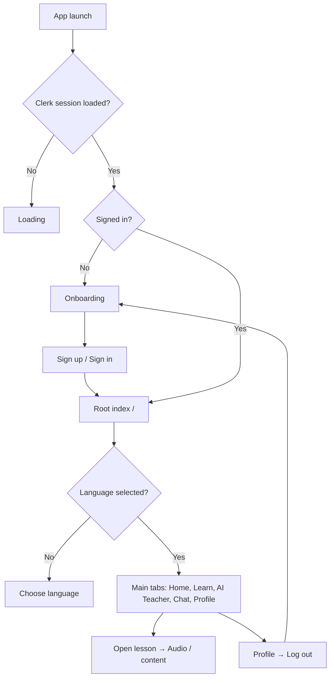

# Lingua — Duolingo-Inspired AI Language Learning App

**Lingua** is a production-style **teaching project**: a mobile language-learning app built with **Expo** and **React Native**, inspired by playful apps like Duolingo, extended with **real-time AI** (Stream audio/video, Vision Agents, live captions). The repo is meant to be built **feature by feature**—readable code first, so developers can follow along step by step.

This is **not** a drop-in clone of Duolingo. It is an educational codebase with hardcoded lesson content, local progress, and server-side secrets for AI and realtime services.

---

## Table of Contents

- [What the App Does](#what-the-app-does)
- [User Journey](#user-journey)
- [What Is Implemented Today](#what-is-implemented-today)
- [Architecture Overview](#architecture-overview)
- [Tech Stack](#tech-stack)
- [Project Structure](#project-structure)
- [Design System](#design-system)
- [Authentication](#authentication)
- [Realtime & AI](#realtime--ai)
- [Local State & Content](#local-state--content)
- [Feature Curriculum](#feature-curriculum)
- [Prerequisites](#prerequisites)
- [Environment Variables](#environment-variables)
- [Getting Started](#getting-started)
- [Running the Vision Agent](#running-the-vision-agent)
- [Available Scripts](#available-scripts)
- [Security](#security)
- [AI-Assisted Development](#ai-assisted-development)
- [License & Disclaimer](#license--disclaimer)

---

## What the App Does

Lingua helps users **learn a language** through:

| Capability | Description |
|------------|-------------|
| **Onboarding** | Welcome screen introducing the AI teacher concept |
| **Authentication** | Sign up / sign in with email or social OAuth (Clerk) |
| **Language selection** | Pick a language to study (persisted locally) |
| **Home hub** | Streak, daily XP goal, continue learning, today’s plan |
| **Lesson paths** | Unit-based lessons with vocabulary and progress |
| **Audio lessons** | Voice conversation with an AI teacher over Stream |
| **Live captions** | Real-time transcription of user and AI speech during audio lessons |
| **Video AI teacher** | Stream + Vision Agents integration (in progress on dedicated tabs) |
| **Local progress** | XP, streak, completed lessons (Zustand + AsyncStorage) |

Lesson **content** lives in TypeScript under `src/data/`. There is **no database** in this version—only JSON/TS content and on-device persistence.

---

## User Journey



**Entry routing** (`src/app/index.tsx`):

1. Not signed in → `/onboarding`
2. Signed in, no language → `/language`
3. Signed in + language → `/(tabs)` (home and bottom navigation)

**Log out** (Profile tab): clears the Clerk session and sends the user back to **onboarding** (welcome + path to sign-in). Tab screens are protected—signed-out users cannot stay on home or profile.

---

## What Is Implemented Today

| Area | Status |
|------|--------|
| Expo Router, NativeWind v5, Lingua design tokens | Done |
| Onboarding, auth UI, Clerk (email + OAuth) | Done |
| Language picker + Zustand persistence | Done |
| Bottom tabs + custom tab bar | Done |
| Home screen (streak, XP, continue, today’s plan) | Done |
| Lesson list & lesson detail UI | Done |
| Stream audio lessons + API routes for tokens/calls | Done |
| Vision Agent (Python) + start/stop API routes | Done |
| Live captions hook + audio lesson UI wiring | Done |
| Profile: change language, log out, dev “clear storage” | Done |
| AI Teacher / Chat tabs | Placeholder screens |
| PostHog analytics | Planned (prompt 18) |

---

## Architecture Overview

```txt
┌─────────────────────────────────────────────────────────────┐
│  Expo app (React Native)                                     │
│  src/app/          Routes & screens                          │
│  src/components/   UI                                        │
│  src/store/        Zustand + AsyncStorage                    │
│  src/data/         Lessons, languages, units                 │
│  src/hooks/        Stream audio, vision agent, captions      │
└───────────────┬─────────────────────────────┬───────────────┘
                │                             │
                ▼                             ▼
┌───────────────────────────┐   ┌────────────────────────────┐
│  Expo API routes           │   │  vision-agent/ (Python)     │
│  src/app/api/              │   │  Gemini Live + Stream Edge  │
│  Clerk, Stream tokens,     │   │  Voice teacher + captions   │
│  vision-agent start/stop   │   │  HTTP on :8000              │
└───────────────────────────┘   └────────────────────────────┘
                │
                ▼
        Clerk · Stream · Google (Gemini)
```

**Principles** (see also [AGENTS.md](./AGENTS.md)):

1. **No secrets in the client** — API keys and token minting only in API routes or the Python agent.
2. **No database** — content in `src/data/`, progress in Zustand.
3. **Feature-by-feature** — smallest working slice, then polish.
4. **Teachable code** — clear folders, minimal abstraction.

---

## Tech Stack

| Layer | Technology |
|-------|------------|
| Framework | [Expo SDK 55](https://docs.expo.dev/versions/v55.0.0/) |
| UI | React Native 0.83, React 19 |
| Language | TypeScript (strict) |
| Routing | [Expo Router](https://docs.expo.dev/router/introduction/) (typed routes) |
| Styling | [NativeWind v5](https://www.nativewind.dev/) + Tailwind CSS v4 |
| Fonts | Poppins |
| Client state | [Zustand](https://github.com/pmndrs/zustand) + AsyncStorage |
| Auth | [Clerk](https://clerk.com/docs/expo/getting-started/quickstart) (`@clerk/expo`, SecureStore token cache) |
| Realtime audio/video | [Stream](https://getstream.io/) (`@stream-io/video-react-native-sdk`) |
| AI voice teacher | Stream Vision Agents + **Gemini Live** (`vision-agent/`) |
| Backend in repo | Expo API routes under `src/app/api/` |
| Analytics (planned) | PostHog |

Use **[Expo v55 docs](https://docs.expo.dev/versions/v55.0.0/)** and the **installed** NativeWind version in `package.json`—do not mix setup from other SDK versions.

---

## Project Structure

```txt
duoligo-clone/
├── assets/                    # Images, fonts, icons
├── src/
│   ├── app/                   # Expo Router — screens & API routes only
│   │   ├── (auth)/            # sign-in, sign-up (redirect if already signed in)
│   │   ├── (tabs)/            # Main app tabs (auth-guarded)
│   │   ├── api/               # stream/token, stream/call, vision-agent/*, …
│   │   ├── lesson/            # Lesson flows
│   │   ├── index.tsx          # Auth + language routing
│   │   ├── onboarding.tsx
│   │   └── language.tsx
│   ├── components/            # Reusable UI (home, lesson, audio-lesson, auth, …)
│   ├── constants/             # e.g. images.ts
│   ├── data/                  # languages, lessons, units
│   ├── hooks/                 # Stream, vision agent, live captions, hydration
│   ├── lib/                   # Clerk, Stream, API helpers, auth navigation
│   ├── store/                 # language-store, progress-store
│   ├── theme/                 # Colors, typography, fonts
│   ├── prompts/               # Step-by-step build curriculum
│   └── prompt_material/       # UI reference PNGs per step
├── vision-agent/              # Python Gemini Live voice teacher + HTTP server
├── AGENTS.md                  # Rules for humans and AI agents
├── app.json                   # Scheme, plugins, experiments
└── global.css                 # Root Tailwind entry
```

**Path aliases** (`tsconfig.json`): `@/*` → `./src/*`, `@/assets/*` → `./assets/*`

---

## Design System

Brand tokens live in `src/theme/` and Tailwind utilities in `src/app/global.css`. Reference: `src/prompt_material/01-design-system.png`.

| Token | Role |
|-------|------|
| `lingua-purple` / `lingua-deep-purple` | Primary brand |
| `lingua-blue` / `lingua-green` | Accents, success |
| `streak`, `warning`, `error` | Semantic feedback |
| Poppins + `text-h1`, `text-body-medium`, etc. | Typography |

**Styling:** Prefer NativeWind `className`. Use `StyleSheet` / inline only where NativeWind does not apply (`SafeAreaView`, animated values, some `ScrollView` props)—see `AGENTS.md`.

**Images:** Centralize in `src/constants/images.ts`; avoid scattered `require()` in screens.

---

## Authentication

- **Provider:** Clerk with `ClerkProvider` in `src/app/_layout.tsx` and `tokenCache` from `@clerk/expo/token-cache` (SecureStore).
- **Public routes:** `onboarding`, `(auth)/sign-in`, `(auth)/sign-up`, `oauth-callback`.
- **Protected tabs:** `(tabs)/_layout.tsx` redirects to `/onboarding` when `!isSignedIn`.
- **Log out:** Profile → `signOut()` via `useAuth`, then `router.replace("/onboarding")` (`src/lib/auth-navigation.ts`).

Copy `.env.example` to `.env.local` and set `EXPO_PUBLIC_CLERK_PUBLISHABLE_KEY` and `CLERK_SECRET_KEY` (secret only used in API routes, never shipped to clients as a raw secret in production builds—follow Clerk/EAS guidance for your deployment).

---

## Realtime & AI

### Stream (audio lessons)

- Mobile app requests tokens and creates calls via **`src/app/api/stream/`**.
- Hooks such as `use-stream-audio-lesson.ts` manage join, media, and teardown.
- Requires `STREAM_API_KEY` and `STREAM_API_SECRET` in env (server-side).

### Vision Agent (voice teacher)

- Python service in **`vision-agent/`** uses Gemini Live + Stream Edge.
- Expo routes **`src/app/api/vision-agent/start`** and **`stop`** proxy to the agent URL.
- Set `VISION_AGENT_URL` (default `http://127.0.0.1:8000`) and `GOOGLE_API_KEY` for Gemini.

### Live captions

- Agent forwards transcription events; app consumes them via `use-live-captions.ts` during audio lessons.

Details: [vision-agent/README.md](./vision-agent/README.md).

---

## Local State & Content

| Store | Purpose |
|-------|---------|
| `language-store` | Selected language ID (persisted) |
| `progress-store` | Completed lessons, XP, streak, daily goal |

Content: `src/data/languages.ts`, `lessons.ts`, `units.ts`, etc. Screens compose data through helpers in `src/lib/`.

---

## Feature Curriculum

Numbered prompts in `src/prompts/` define the recommended build order. Each step says to read `AGENTS.md` first.

| Step | File | Focus |
|------|------|--------|
| 01 | `01-nativewind.md` | NativeWind v5 in Expo |
| 02 | `02-design-theme.md` | Colors, typography, Poppins |
| 03 | `03-onboarding-ui.md` | Onboarding |
| 04 | `04-authentication-ui.md` | Auth UI (mocked) |
| 05 | `05-clerk.md` | Clerk integration |
| 06 | `06-content-system.md` | Lesson/language data |
| 07 | `07-language-ui.md` | Language selection |
| 08 | `08-zustand.md` | Global state + persistence |
| 09 | `09-bottom-tab-nav.md` | Tab navigation |
| 10 | `10-home-ui.md` | Home screen |
| 11 | `11-lesson-ui.md` | Lesson screen |
| 12 | `12-audio-lesson-ui.md` | Audio lesson UI |
| 13 | `13-stream-integration.md` | Stream + API routes |
| 14 | `14-vision-agents.md` | AI video/voice teacher |
| 15 | `15-connection-to-ui.md` | Wire realtime to UI |
| 16 | `16-ai-teacher-improvements.md` | AI teacher polish |
| 17 | `17-live-captions.md` | Live captions |
| 18 | `18-more-posthog.md` | Analytics |
| 19 | `19-ux-ui-fixes.md` | Lesson UX (e.g. audio controls) |

Matching screenshots: `src/prompt_material/`.

---

## Prerequisites

- **Node.js** 18+ (LTS recommended)
- **npm**
- **Expo dev client** recommended for Stream WebRTC (Expo Go is limited for native modules)
- iOS Simulator and/or Android emulator for device testing
- For audio/AI features: **Clerk**, **Stream**, and **Google AI** accounts
- For Vision Agent: **Python 3.12+** and [uv](https://docs.astral.sh/uv/) (or pip)

---

## Environment Variables

Copy `.env.example` to `.env.local` at the project root (and optionally `vision-agent/.env`):

| Variable | Used by | Purpose |
|----------|---------|---------|
| `EXPO_PUBLIC_CLERK_PUBLISHABLE_KEY` | App | Clerk client |
| `CLERK_SECRET_KEY` | API routes | Clerk server |
| `STREAM_API_KEY` / `STREAM_API_SECRET` | API routes, vision-agent | Stream calls |
| `GOOGLE_API_KEY` | vision-agent | Gemini Live |
| `VISION_AGENT_URL` | API routes | Agent HTTP base (default `http://127.0.0.1:8000`) |
| `EXPO_PUBLIC_API_URL` | Optional | Production API base for native clients |

Never commit `.env`, `.env.local`, or credential files.

---

## Getting Started

### 1. Install dependencies

```bash
npm install
```

### 2. Configure environment

```bash
cp .env.example .env.local
# Edit .env.local with your Clerk, Stream, and Google keys
```

### 3. Start Expo

```bash
npm start
```

Then:

- **iOS** — `npm run ios`
- **Android** — `npm run android`
- **Web** — `npm run web`

Routes live under `src/app/`. Root layout loads Poppins and hides the splash screen when fonts are ready.

### 4. Test auth flow

1. Open app → onboarding → sign up or sign in.
2. Choose a language → land on home tabs.
3. Profile → **Log out** → should return to onboarding (not stay on tabs).

---

## Running the Vision Agent

```bash
cd vision-agent
uv sync
uv run main.py serve --host 127.0.0.1 --port 8000
```

Health: `GET http://127.0.0.1:8000/health`

Ensure `VISION_AGENT_URL` in `.env.local` matches. Start an **audio lesson** from the app while the agent is running.

See [vision-agent/README.md](./vision-agent/README.md) for models, captions, and console demo mode.

---

## Available Scripts

| Command | Description |
|---------|-------------|
| `npm start` | Expo dev server |
| `npm run ios` | iOS simulator |
| `npm run android` | Android emulator |
| `npm run web` | Web |
| `npm run lint` | ESLint (Expo) |

---

## Security

- Store secrets in `.env.local`, EAS secrets, or server env—**not** in committed files.
- Mint Stream (and similar) tokens only in **`src/app/api/`**.
- Use Clerk for authentication; do not build a custom auth stack.
- Profile **“Clear async storage (test)”** is for development only—it wipes local progress and language choice.

---

## AI-Assisted Development

1. Read **[AGENTS.md](./AGENTS.md)**.
2. Pick the next file in `src/prompts/`.
3. Attach the matching PNG from `src/prompt_material/` for UI work.
4. Run `npm run lint` before finishing.

Do not add major dependencies without approval.

---

## Expo Configuration Highlights

From `app.json`:

- **Scheme:** `duoligoclone` (OAuth deep links)
- **Plugins:** `expo-router`, `expo-font`, `expo-splash-screen`, WebRTC-related config for Stream
- **Experiments:** typed routes, React Compiler

---

## Learn More

- [Expo SDK 55](https://docs.expo.dev/versions/v55.0.0/)
- [Expo Router](https://docs.expo.dev/router/introduction/)
- [NativeWind v5](https://www.nativewind.dev/)
- [Clerk Expo](https://clerk.com/docs/expo/getting-started/quickstart)
- [GetStream](https://getstream.io/)
- [Vision Agents](https://visionagents.ai/)

---

## License & Disclaimer

This is an **educational project** inspired by language-learning apps. It is **not** affiliated with Duolingo or any commercial product. Use it to learn mobile and AI integration—not as a production fork of trademarked experiences.
